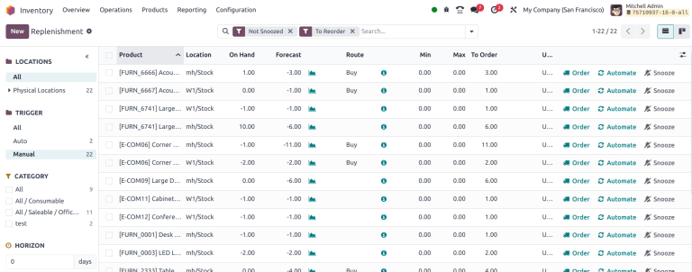
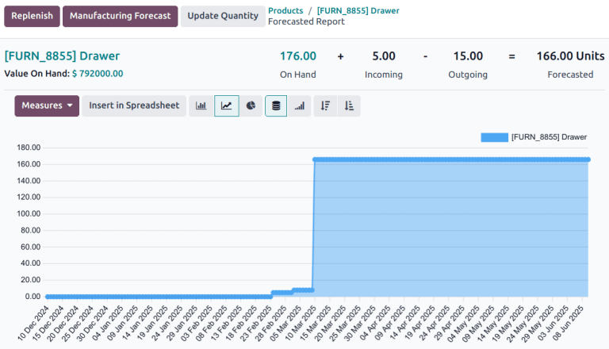
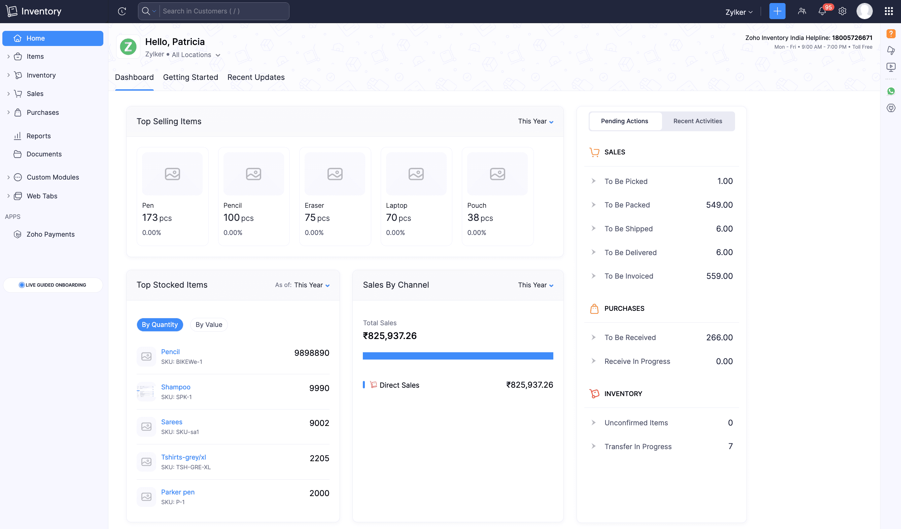
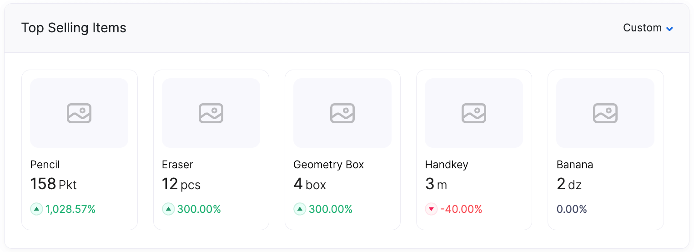

# Entrega 2 — Público-alvo e análise de concorrência

**Data:** 26/08/2026

**Status:** 🟨 em andamento

**Responsabilidade:** cada integrante analisa ao menos uma interface; a equipe produz a comparação.

Nesta entrega, analisamos sistemas com tarefas parecidas às do projeto. O objetivo não é copiar telas, mas entender padrões úteis e problemas que devemos evitar.

## Método e limitações

Consultamos páginas, manuais, imagens oficiais e avaliações públicas. Não criamos contas nem testamos todas as funções, portanto as observações são iniciais. Opiniões de usuários foram tratadas como relatos, não como conclusões universais.

---

# Entrada da Entrega 1

| Item | Tipo | Motivo | Decisão |
|---|---|---|---|
| Odoo Inventory | Interface representativa | Possui previsão e reposição | Analisar como C01 |
| Zoho Inventory | Interface representativa | Possui dashboard e relatórios | Analisar como C02 |
| Planilha | Ferramenta cotidiana | Pode ser usada no controle atual | Validar na Entrega 3 |
| Controle manual | Processo atual possível | Pode explicar parte das dificuldades | Investigar com usuários |

---

# 1. Público-alvo

O público definido na Entrega 1 é o **responsável pelo estoque de um pequeno comércio**. Ele precisa acompanhar produtos, identificar riscos e decidir o que repor.

Acreditamos que esse usuário conheça termos como saldo, entrada, saída, estoque mínimo e fornecedor, mas não necessariamente métricas de aprendizado de máquina.

---

# 2. Concorrentes e interfaces representativas

## C01 — Odoo Inventory

**Autor:** Paulo Andre de Oliveira Hirata — 22.125.072-3

**Tipo:** concorrente indireto/interface representativa

**Fontes:** [Odoo Inventory](https://www.odoo.com/app/inventory-features), [previsão](https://www.odoo.com/documentation/18.0/applications/inventory_and_mrp/inventory/warehouses_storage/reporting/forecast.html) e [reposição](https://www.odoo.com/documentation/18.0/applications/inventory_and_mrp/inventory/warehouses_storage/replenishment/report.html)

**Acesso:** 26/08/2026

### Contexto

O Odoo é um sistema empresarial amplo. Seu módulo de estoque reúne produtos, movimentações, previsões e reposições. Ele é maior que nosso projeto, mas realiza tarefas próximas às definidas na Entrega 1.

### Funcionalidades relevantes

| Funcionalidade | Como funciona | Observação de IHC |
|---|---|---|
| Painel de reposição | Lista saldo atual, previsto e quantidade a pedir | Aproxima informação e ação, mas a tabela é densa |
| Previsão | Combina saldo, entradas e saídas em gráfico | Ajuda a entender de onde vem o valor previsto |
| Busca e filtros | Filtra produtos, locais e categorias | Facilita catálogos grandes, mas muitos filtros podem confundir |
| Regras de reposição | Sugere ou gera pedidos por limites e prazos | A automação precisa de revisão e confirmação |

*Figura C01.1 — Painel de reposição. Fonte: documentação oficial do Odoo.*

*Figura C01.2 — Estoque atual, entradas, saídas e previsão. Fonte: documentação oficial do Odoo.*

### Experiência e preço

Na [Capterra](https://www.capterra.com/p/135618/Odoo/reviews/), o produto apresentava 4,2/5 em 1.323 avaliações e 4,0/5 em facilidade de uso. Usuários elogiam integração e flexibilidade, mas também citam curva de aprendizagem e configuração complexa. As avaliações tratam o Odoo como um todo e algumas são incentivadas.

O Odoo possui modalidade gratuita para um aplicativo e planos pagos por usuário. Os valores variam conforme país e personalização.

### Lição principal

Mostrar como a previsão foi formada e manter a ação de reposição próxima do detalhe, sem repetir a quantidade de informações de um ERP completo.

---

## C02 — Zoho Inventory

**Autor:** Victor Merker Binda — **[?] matrícula a preencher**

**Tipo:** concorrente indireto/interface representativa

**Fontes:** [Zoho Inventory](https://www.zoho.com/us/inventory/), [dashboard](https://www.zoho.com/inventory/help/getting-started/dashboard.html) e [relatórios](https://www.zoho.com/us/inventory/help/reports/inventory-reports.html)

**Acesso:** 26/08/2026

### Contexto

O Zoho Inventory gerencia estoque, vendas, compras e armazéns. Seu dashboard resume indicadores e ações pendentes, enquanto os relatórios detalham saldos e movimentações.

### Funcionalidades relevantes

| Funcionalidade | Como funciona | Observação de IHC |
|---|---|---|
| Dashboard | Reúne itens, vendas, compras e pendências | Facilita a visão geral, mas pode dispersar o foco |
| Comparação por período | Mostra quantidade e variação percentual | Usa valor, seta e cor para indicar mudança |
| Relatórios | Apresenta saldos, movimentos e reposições com filtros | Cada relatório responde a uma tarefa específica |
| Ações pendentes | Leva o usuário do indicador à lista correspondente | Transforma informação em próxima ação |

*Figura C02.1 — Dashboard e ações pendentes. Fonte: documentação oficial do Zoho.*

*Figura C02.2 — Comparação de itens por período. Fonte: documentação oficial do Zoho.*

### Experiência e preço

Na [Capterra](https://www.capterra.com/p/146241/Zoho-Inventory/reviews/), havia 420 avaliações e nota 4,4/5 em facilidade de uso. Usuários citam organização, busca e relatórios como pontos positivos; configuração e importação aparecem como dificuldades. Algumas avaliações são incentivadas.

O produto oferece plano gratuito limitado e planos pagos por organização. No acesso, os planos anuais começavam em US$ 29 por organização/mês, sujeitos a mudanças e diferenças regionais.

### Lição principal

Usar uma visão geral focada em riscos e permitir que o usuário avance diretamente para o produto ou tarefa que precisa de atenção.

---

# 3. Softwares cotidianos do público

O uso destas ferramentas pelo público ainda é hipótese e será validado na Entrega 3.

| Software | Uso possível | Padrões que podem ser familiares |
|---|---|---|
| Excel/Google Sheets | Registrar produtos e compras | Tabelas, filtros, ordenação e CSV |
| Sistema de vendas | Registrar vendas e atualizar saldo | Busca, código do produto e confirmação |
| Aplicativo de mensagens | Contato com funcionários e fornecedores | Notificações e mensagens curtas |

## 3.1 Padrões relevantes

| Padrão | Produto | Tarefa | Aplicação no projeto |
|---|---|---|---|
| Visão de exceções | Odoo/Zoho | Encontrar produtos em risco | Sim, focada em reposição |
| Relatório detalhado | Odoo/Zoho | Entender saldo e previsão | Sim, com poucas informações essenciais |
| Histórico e filtros | Odoo/Zoho | Rever produtos e períodos | Sim |
| Comparação | Odoo/Zoho | Comparar atual, previsto e realizado | Sim |
| Cadastro/CRUD | Odoo/Zoho | Manter produtos e regras | Talvez, apenas o essencial |

---

# 4. Síntese comparativa

| Critério | C01 — Odoo | C02 — Zoho | Oportunidade para o projeto |
|---|---|---|---|
| Navegação | Listas e detalhes densos | Menu lateral e dashboard | Fluxo curto: risco → detalhe → decisão |
| Feedback | Mostra composição do previsto | Mostra indicadores e pendências | Exibir período, atualização e motivo do risco |
| Erros | Automação exige cuidado | Relatórios ajudam na conferência | Validar dados e confirmar decisões |
| Terminologia | Mais técnica | Mistura vendas, compras e estoque | Usar linguagem do pequeno comércio |
| Acessibilidade | Não verificada | Não verificada; usa cor e seta | Não depender somente de cores |
| Eficiência | Busca, filtros e ações por linha | Atalhos e relatórios | Priorizar exceções e busca simples |

Os dois produtos mostram que controlar estoque envolve mais do que olhar o saldo. O Odoo explica melhor como a previsão é formada; o Zoho apresenta uma visão geral mais fácil de explorar. Nosso projeto deve aproveitar essas ideias sem tentar reproduzir um ERP.

---

# 5. Recomendações

- **RC01:** Usar o fluxo visão de riscos → detalhe da previsão → decisão de reposição — C01/C02.
- **RC02:** Mostrar saldo, entradas, saídas, previsão, período e atualização — C01.
- **RC03:** Criar alertas que expliquem o motivo e levem à próxima ação — C01/C02.
- **RC04:** Oferecer busca e poucos filtros úteis, como risco, categoria e período — C01/C02.
- **RC05:** Explicar métricas sob demanda e usar linguagem comercial — C01 e H02/H04.
- **RC06:** Validar dados e pedir confirmação antes de registrar uma reposição — avaliações de C01/C02.
- **RC07:** Não depender apenas de vermelho e verde para comunicar estados — C02.

---

# Referências

- ODOO. [Inventory Features](https://www.odoo.com/app/inventory-features). Acesso em: 26 ago. 2026.
- ODOO. [Forecasted Report](https://www.odoo.com/documentation/18.0/applications/inventory_and_mrp/inventory/warehouses_storage/reporting/forecast.html). Acesso em: 26 ago. 2026.
- ODOO. [Replenishment Report](https://www.odoo.com/documentation/18.0/applications/inventory_and_mrp/inventory/warehouses_storage/replenishment/report.html). Acesso em: 26 ago. 2026.
- ZOHO. [Dashboard](https://www.zoho.com/inventory/help/getting-started/dashboard.html). Acesso em: 26 ago. 2026.
- ZOHO. [Inventory Reports](https://www.zoho.com/us/inventory/help/reports/inventory-reports.html). Acesso em: 26 ago. 2026.
- CAPTERRA. [Odoo Reviews](https://www.capterra.com/p/135618/Odoo/reviews/) e [Zoho Inventory Reviews](https://www.capterra.com/p/146241/Zoho-Inventory/reviews/). Acesso em: 26 ago. 2026.

---

# Checklist

- [x] Alternativas da Entrega 1 foram retomadas.
- [x] Há uma análise por integrante e prints legíveis.
- [x] Opiniões e dados possuem fontes.
- [x] Padrões foram ligados a tarefas reais.
- [x] A comparação gerou recomendações para o projeto.

## Pendências

- [?] Matrícula de Victor Merker Binda.
- [?] Confirmar com usuários quais ferramentas fazem parte do processo atual.
- [?] Avaliar acessibilidade nos protótipos posteriores.
